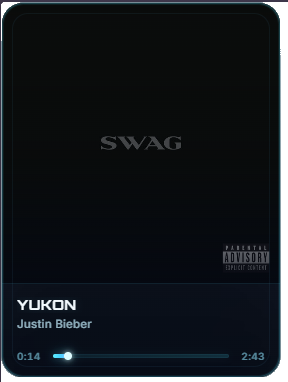

<table>
  <tr>
    <td width="65%" valign="middle" align="left" style="border: none; padding: 20px;">

<div align="center">
  <h1>🎧 Spotify Now Playing Overlay</h1>


<p>
A lightweight and visually polished Spotify "Now Playing" overlay designed for OBS.
</p>

<p>
It displays real-time track information including album cover, title, artist, and playback progress with smooth animations and state transitions.
</p>
</div>
<div align="center">
  
  
  
</div>

  </td>

  <td width="35%" align="center" valign="middle" style="border: none; padding: 20px;">
    
  </td>
  </tr>
</table>

---

## ✨ Features

- 🎵 Real-time Spotify playback sync
- 🖼️ Animated album cover transitions
- ⏱️ Smooth progress bar with drift correction
- ⏸️ Pause and idle states
- ⚡ Lightweight and local (no cloud required)
- 🎥 Perfect for OBS streaming setups

---

## 🧠 How it works

This project uses:

- **Spotify Web API** for playback data (**Spotify Premium Account is required**)
- **Node.js (Express)** as a local server
- **Polling system** to fetch current track
- **Frontend widget (HTML/CSS/JS)** for rendering

Flow:

1. User authenticates with Spotify
2. Server stores access & refresh tokens locally
3. A poller fetches "currently playing" data every few seconds
4. Frontend consumes `/api/now-playing`
5. UI updates smoothly with animations and local time sync

---


---

## 📦 Installation

### 1. Clone the repository

```bash
git clone https://github.com/mau143429/spotify-now-playing-overlay.git
cd spotify-now-playing-overlay
```

---

### 2. Install dependencies

```bash
npm install
```

---

### 3. Create `.env`

Use the included `.env.example` as a base:

```bash
cp .env.example .env
```

Then edit it:

```env
SPOTIFY_CLIENT_ID=your_client_id
SPOTIFY_CLIENT_SECRET=your_client_secret
SPOTIFY_REDIRECT_URI=http://127.0.0.1:3000/callback
PORT=3000
```

---

## 🔑 Spotify App Setup

1. Go to: https://developer.spotify.com/dashboard  
2. Create a new app  
3. Add this Redirect URI:

```
http://127.0.0.1:3000/callback
```

4. Copy Client ID & Secret into `.env`

---

## ▶️ Running the app

```bash
npm start
```

Then open:

```
http://127.0.0.1:3000/login
```

Authorize Spotify and you're done.

---

## 📡 OBS Integration

### 1. Add a Browser Source

- Add → Browser Source  
- URL:

```
http://127.0.0.1:3000
```

### 2. Recommended settings

- Width: 300  
- Height: 420  
- Enable:
  - Refresh when scene becomes active  
  - Shutdown when not visible  

---

## ⚙️ Optional: Auto-start with Windows

A `.vbs` example is included.

Edit it:

```vbscript
Set WshShell = CreateObject("WScript.Shell")
WshShell.Run "cmd /c cd /d ""C:\path\to\spotify-now-playing-overlay"" && npm start", 0, False
```

Then place it in:

```
Win + R → shell:startup
```

---

## 🔒 Security Notes

- `.env` is NOT included in the repo  
- `.tokens.json` is generated locally  
- NEVER commit `.tokens.json`  

---

## 🛠️ Project Structure

```
public/
  ├── index.html
  ├── css/
  │    └── overlay.css
  └── js/
       └── overlay.js

src/
  ├── app.js
  ├── config.js
  ├── spotify.js
  ├── token-store.js
  └── poller.js
```

---

## 📄 License

MIT License

---

## 👨‍💻 Author

Mauricio Calderon 

If you found this useful, consider starring ⭐ the repo.
